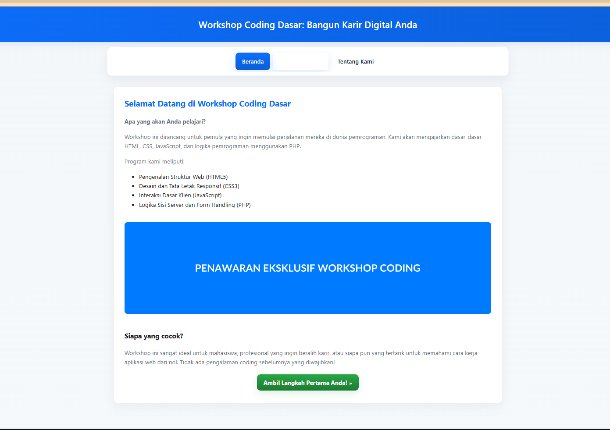
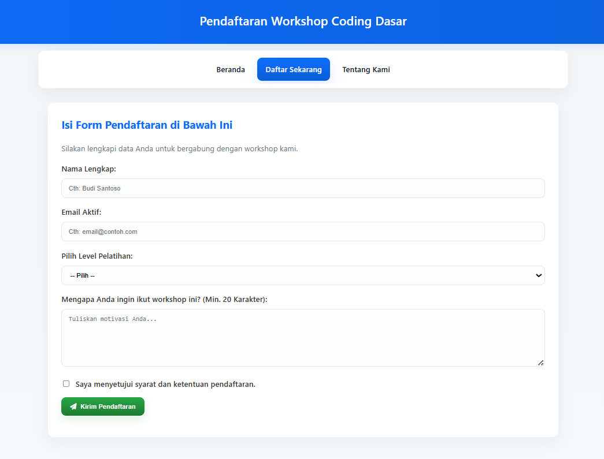
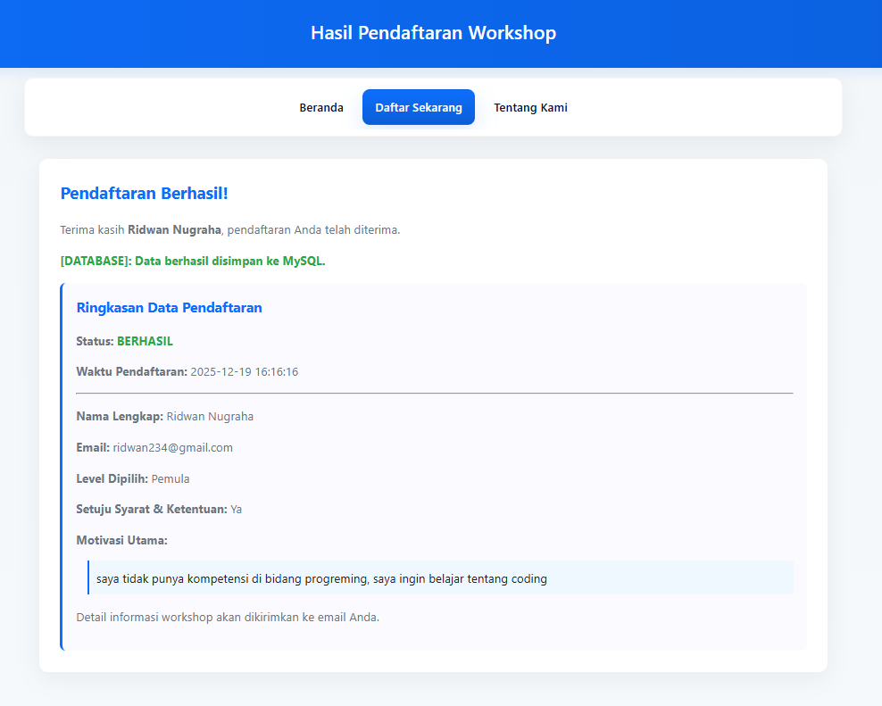

# Laporan Project: Workshop Coding Dasar

## 1. Halaman Judul
- Nama Aplikasi: Workshop Coding Dasar
- Nama & NIM: Yoga Surgana — 1002250078
- Kelas: Eksekutif | Teknologi Informasi

## 2. Pendahuluan
### Latar Belakang
Aplikasi web sederhana ini dibuat sebagai latihan praktis membangun halaman web interaktif untuk pendaftaran workshop. Tujuan utamanya adalah menyediakan formulir pendaftaran yang valid secara client-side dan server-side, menyimpan data ke database, dan menampilkan ringkasan hasil.

Masalah yang ingin diselesaikan: memberikan alur pendaftaran yang jelas, mencegah input tidak valid, dan menampilkan umpan balik (feedback) kepada pengguna.

### Tujuan Pembelajaran
- Mempraktikkan struktur HTML untuk layout dan navigasi.
- Mendesain tampilan responsif dengan CSS (layout, box model, responsive navbar).
- Menggunakan PHP untuk pemrosesan form, validasi server-side, dan penyimpanan ke database MySQL (prepared statements).
- Menggunakan JavaScript untuk validasi sisi-klien dan interaksi UI (toast, navbar toggle).

## 3. Perancangan Aplikasi
### Struktur Halaman & Navigasi (ringkas)
- `index.php` — Halaman beranda (informasi workshop).
- `form.php` — Halaman form pendaftaran (input user).
- `process.php` — Endpoint untuk memproses POST, melakukan validasi server, menyimpan ke DB, dan menampilkan ringkasan.
- `about.php` — Halaman tentang.
- Asset: `css/style.css`, `js/script.js`, `db/db_schema.sql`.

Diagram sederhana (linear):

Home -> Form -> Process (simpan ke DB) -> Result (ringkasan)

### Desain Tampilan (singkat)
- Layout: container pusat dengan `max-width` (`--max-width: 1100px`) dan padding.
- Header: gradasi biru (`--primary`) di bagian atas.
- Navbar: kotak putih ber-radius, CTA berwarna primer untuk "Daftar Sekarang".
- Form: elemen `label` + `input`/`select`/`textarea` dalam `.form-group`. Input diberi border-radius, padding konsisten.
- Teknik CSS yang digunakan: custom properties (`:root`), flexbox untuk navbar (`display:flex`), responsive media queries (`@media (max-width:700px)`), transitions/animations untuk mobile menu (max-height, opacity, staggered delays).

Contoh penggunaan class/id:
- `#container`, `#header`, `.main-content`, `.form-group`, `.button-submit`, `.nav-cta`.

## 4. Implementasi

### Screenshot (placeholder)
Berikut screenshot placeholder yang saya tambahkan di folder `docs/` — Anda bisa mengganti file ini dengan screenshot aktual dari browser.

- Home: `index.php` — 
- Form: `form.php` — 
- Hasil: `process.php` — 

(Untuk menggunakan screenshot nyata: ambil screenshot layar Anda, simpan di `docs/` dengan nama `home.png`, `form.png`, `result.png`, lalu gantikan link di atas jika perlu.)

### Cuplikan Kode Penting

- Struktur navigasi (HTML) — bagian dari `form.php`:

```html
<nav id="navbar">
  <button id="navToggle" class="navbar-toggle" aria-expanded="false" aria-controls="navMenu">
    <i class="fa-solid fa-bars"></i><span class="sr-only">Menu</span>
  </button>
  <div id="navMenu" class="nav-menu">
    <ul>
      <li class="<?php echo ($active_page == 'home' ? 'active' : ''); ?>"><a href="index.php">Beranda</a></li>
      <li class="<?php echo ($active_page == 'form' ? 'active' : ''); ?>"><a href="form.php" class="nav-cta">Daftar Sekarang</a></li>
      <li class="<?php echo ($active_page == 'about' ? 'active' : ''); ?>"><a href="about.php">Tentang Kami</a></li>
    </ul>
  </div>
</nav>
```

- Styling (CSS) — potongan dari `css/style.css` (navbar & form):

```css
:root{ --primary:#0d6efd; --primary-dark:#0b5ed7; --max-width:1100px; }
#container{ max-width:var(--max-width); margin:30px auto; padding:0 20px 40px; }
#navbar{ background:#fff; padding:8px 12px; border-radius:12px; box-shadow:0 10px 30px rgba(2,6,23,0.06); }
.form-group input, .form-group select, .form-group textarea{ width:100%; padding:12px 14px; border:1px solid #e3e7ec; border-radius:10px; }
.nav-cta{ background:linear-gradient(180deg,var(--primary),var(--primary-dark)); color:#fff; }
@media (max-width:700px){ .nav-menu{ max-height:0; transition:max-height .32s, opacity .22s; } #navbar.open .nav-menu{ max-height:420px; } }
```

- PHP pemrosesan form (potongan kunci dari `process.php`):

```php
// Validasi server-side
if (empty($nama) || strlen($nama) < 5) { $error_messages[] = "Nama lengkap wajib diisi dan minimal 5 karakter."; $is_valid = false; }
if (!filter_var($email, FILTER_VALIDATE_EMAIL)) { $error_messages[] = "Format email tidak valid."; $is_valid = false; }
// Simpan ke DB menggunakan prepared statement
$sql = "INSERT INTO registrations (nama, email, level, motivasi, setuju, waktu_daftar_client) VALUES (?, ?, ?, ?, ?, ?)";
if ($stmt = $conn->prepare($sql)){
  $stmt->bind_param("ssssds", $nama, $email, $level, $motivasi, $setuju_db, $waktu_daftar);
  $stmt->execute();
  $stmt->close();
}
```

> Catatan: pastikan `db_config.php` menginisialisasi koneksi `$conn` (MySQLi) dan tabel `registrations` ada sesuai `db/database_schema.sql`.

- JavaScript (potongan dari `js/script.js`) — validasi client-side dan toast:

```javascript
// Validasi singkat sebelum submit
const emailRegex = /^[^\s@]+@[^\s@]+\.[^\s@]+$/;
if (email === '' || !emailRegex.test(email)) { show error }
// showToast utility
function showToast(type, message, duration = 4500){ /* create toast element and auto-remove */ }
// Navbar toggle (mobile)
navToggle.addEventListener('click', function(){ navbar.classList.toggle('open'); swap icons });
```

### OOP PHP
Project ini tidak menggunakan OOP — proses ditulis dengan pendekatan prosedural + prepared statements.

## 5. Pengujian Singkat (3 skenario minimal)

1) Input lengkap & valid
- Input: nama "Budi Santoso", email "budi@example.com", level "Pemula", motivasi panjang > 20, centang setuju.
- Hasil: `process.php` menampilkan "Pendaftaran Berhasil"; data disimpan ke tabel `registrations`; toast sukses muncul.

2) Input kosong / field wajib kosong
- Input: nama kosong atau email kosong.
- Hasil: client-side menampilkan pesan error di bawah field; jika bypass client-side (mengirim POST langsung), server-side menolak dan menampilkan halaman gagal dengan daftar error.

3) Format salah (email tidak valid) atau motivasi pendek
- Input: email `salah@`, motivasi `kurang`.
- Hasil: validasi client-side menolak, menampilkan pesan; server-side juga menolak jika request dikirim.

(Tambah skenario DB error: coba submit email yang sudah terdaftar — `process.php` menangani error duplicate dan menampilkan pesan DB spesifik.)

## 6. Kesimpulan
- Pelajaran teknis:
  - HTML/CSS: pentingnya struktur semantic, penggunaan flexbox, responsive rules, dan transisi untuk UX.
  - PHP (server-side): selalu validasi input di server meskipun sudah ada validasi client; gunakan prepared statements untuk menghindari SQL injection dan sanitasi output untuk XSS.
  - Form handling: gunakan atribut `required`, `type="email"` pada input, dan fallback server-side.
  - JavaScript: tingkatkan UX dengan validasi real-time, toast feedback, dan interaksi (navbar toggle).

- Rekomendasi perbaikan / pengembangan selanjutnya:
  - Implementasikan session-based flash messages untuk komunikasi server->client tanpa query params.
  - Tambahkan fitur manajemen pendaftar (halaman admin) dengan autentikasi.
  - Simpan file screenshot di `docs/` dan sertakan gambar di laporan akhir.

---

### Referensi file utama (workspace)
- Halaman utama: [index.php](index.php)
- Form: [form.php](form.php)
- Pemrosesan: [process.php](process.php)
- Style: [css/style.css](css/style.css)
- JS: [js/script.js](js/script.js)


---
